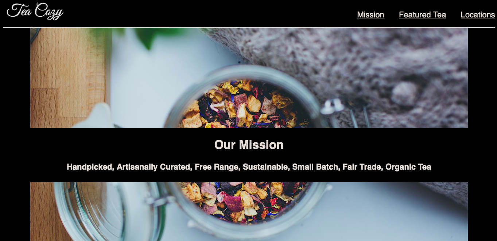

# Tea Cozy Project

## Goal
The goal of this project was to create a webpage based for a website called Tea Cozy. The spec was provided and can be seen in *resources/spec*.

## Languages & Tools Used
1. HTML
2. CSS
3. Git and Github
4. Command Line Interface